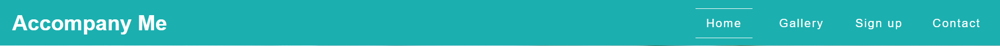
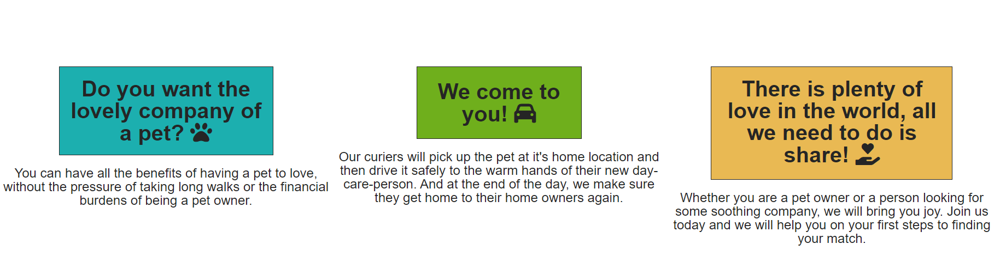
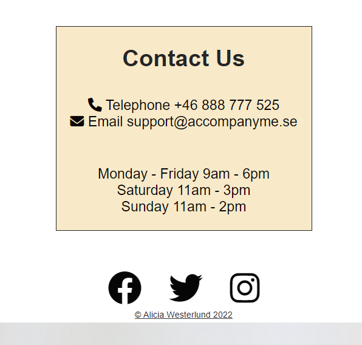
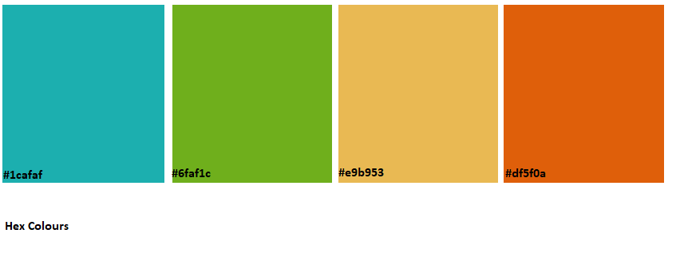

# Welcome to Accompany Me!

Accompany me is a website for both pet owners to find a daycare person to give their pets company and a more personalized experience than the kennels out there, 
and also for elderly people who feel they would love to have the company of a pet but who don't have the energy or time to take care of say pet full time.
The elderly people who are interested in this, volunteer for the job without any expectations to pay for animal food, take walks or pay for any insurance for the pets.

The pet owner alone stands for the cost of the day care, which essentially goes as payment to the courier for picking up and delivering the pet to and from it's home location or set appointed place of pickup.
The pet owner also holds responsebility to for example walk the dog beforehand and send with them any animal food that they want their daycare-person to give to their pet.

At the home page you will find initial information about how the business works, there is a gallery where you can see different pets who are currently in the market of finding their daycare person, as well as some of the pairs that already been made through our website.

At the signup page you can file your first name, last name, email address and what service you are intested in with Accompany me.
There you can write your personal preference, what kind of pet you are interested in giving company to, what kind of person you are and what you are looking for when coming to us, again this goes both ways for either pet owners or people who are interested in volunteering for daycare.

We then will send you additional information and take the first steps to finding you the match you are looking for. 

Under contacts, you will also find our telephone number, as well as our email, should you want to speak to us about any questions you might have about us, about the process or general information about our business.

Our goal is to make you feel at ease with your collaboration with us, and such our website is made to fit for those who are generally not advanced in computer technology, with an easy navigation and just the right amount of information at the get go for an easier understanding of the process and what our company is about.

We thank you for reading this and hope you have a nice tour of Accompany Me!

------------------------------------------------------------------------------------------------------------------------------------------------------------------------------

# The stategy!

* As mentioned above the site is created for eyes who have seen much. 
Thus the icons are bigger, the information is in different colored boxes with light backrounds for an easy read, 
and made with big font-sizes.
* The website is also made to fit very large screens since one of our main target users are people who
 most likely are inclined to have big screens on their computers and perhaps not so keen on using smartphones.
So the website is made for a big range of screen sizes to fit our need for our general audience. 

## The Users Goals

* The user needs to find a daycare person for their pets -or-
* The user wants to find a pet for some dayly company.

## A New User
* Can easely find what our website is about.
* Can find images of pet's already looking for daycare.
* Can easely initiate first contact and write their needs and expectations of our service.
* Can contact our customer care for questions both before and after applying their own contact information and moving further into the process.

------------------------------------------------------------------------------------------------------------------------------------------------------------------------------
# Strategy
------------------------------------------------------------------------------------------------------------------------------------------------------------------------------
## Header

The company name logo and hero image are both responsive and change in size depending on different viewports.
The logo is responsive with a link directing them to he home page from any other page on the website.

----------------------------------------------------------------------------------------------------------------------------------------------------------------------------
## Navigation

Links to different pages, Home, Gallery, Signup.
Links contact to the contact section on the home page no matter what page you are on.
Menu items change backround colour when hovered over.

-----------------------------------------------------------------------------------------------------------------------------------------------------------------------------
## Personal pet care

Shows the user what Accompany me is about.
Hero image also shows an indication for the user as to what it could look like to look further into our business.

-----------------------------------------------------------------------------------------------------------------------------------------------------------------------------
## Reasons

Asks the user a question to pull them in for further interest, as well as explaining how easy it can be.
Describes in more detail what kind of service we provide for both pet owners and volunteers.
Motivational text implying even further how easy it is to take the first steps into making every-day life a little better.

-----------------------------------------------------------------------------------------------------------------------------------------------------------------------------
## Contact

Simply displayed contact information to Accompany me through either phone or email.
Days and times written so the user can see during which hours they can expect a reply.

-----------------------------------------------------------------------------------------------------------------------------------------------------------------------------
## Gallery

Different images showing the various options of pets in our pet-pool who need a day-care person,
but also an indication of what pets that Accompany me accept, that we can help the user find a day-care person for.

------------------------------------------------------------------------------------------------------------------------------------------------------------------------------
## Signup

An easy signup page where the user can put in their:
First name
Last name
Email address
Write who they are and what they are looking for specifically through a collaboration with us.

The submit button holds a text of "Let's find you a match"
And its backround changes color when hovered before clicking.

-------------------------------------------------------------------------------------------------------------------------------------------------------------------------------
## Footer
Holds navigation links to 3 different external social-media websites.
Holds the name of the company creator with a c-rights icon.

------------------------------------------------------------------------------------------------------------------------------------------------------------------------

## Possible upcoming features

* Ads on the bottom of the home page with pictures and descriptions of the different volunteers that are currently looking for a pet to take care of.
* A fifth menu option titled "Work as Courier" where users who are interested in working for us will be able to put in their contact information, submit a CV and other    documents, as well as a link to the police website where they can apply for their load register that they will need to provide to us before being accepted as one of our couriers.
* A popup window for the signup page that will activate once the user has clicked "Let's find you a match."
* A sticky arrow icon that takes the user to the top of the page no matter where they are.

------------------------------------------------------------------------------------------------------------------------------------------------------------------------
# Design

## Colours

* The colours are light and earthy to make the user calm. 
* The header is a soothing turqois that goes well with the colours of the hero image below.
* The colours of the dog in the hero image are used as a red thread throughout the page with a similiar colour scheme.
* Finally the signup page does the same but with the colours a bit darker and toned down, using the signup hero image's colours to further soothe the user and then link those colours with the submit button.
* I mainly used these hex colours for my page.
* 
-----------------------------------------------------------------------------------------------------------------------------------------------------------------------------
## Fonts

* I am using Merriweather, sans serif throughout the entire page for consistency, the font is soft and appealing to the users eye.

----------------------------------------------------------------------------------------------------------------------------------------------------------------------------

# Testing

## As a new user

* Upon arrival the user quickly sees the menu navigation bars and can easely find their way around the page.
* They also see a overlay text over the hero image that both show a strong indication of what the site is for.
* Further down the user then see's more explanatory text, showing what services we have and what Accompany Me is about.
* If the user is interested in further information, they are provided with contact information to do so.

------------------------------------------------------------------------------------------------------------------------------------------------------------------------------

## As a returning user

The customer easely finds the contact information where they can send further questions via email or call our number.

----------------------------------------------------------------------------------------------------------------------------------------------------------------------------

# Validating HTML 5 and CSS 3

* Tested with The [W3C CSS Validation service](https://jigsaw.w3.org/css-validator/). Congratulations! No Error Found.
* Tested with The [W3C Markup Validation service](https://validator.w3.org/). No errors or warnings to show.
* Google Chrome developer tool to find any remaining errors.

----------------------------------------------------------------------------------------------------------------------------------------------------------------------------
# Bugs and fixes

* Noticed I had issues with my submit button not working properly so I went to this website to get the information right.
 https://www.jotform.com/help/118-how-to-customize-the-submit-button-with-css/
* Issues with my footer bar shifting to the left, asked for help on slack and got help from Ronan McGill who pointed out it might be because of my letter-spacing,
changing this to only apply for id's made for first and second icon (.fb, .tw) fixed the issue.
* Ran into some other trouble with my margin and padding throughout the page, got help from my friend Tyler Risinger who then helped me apply at top of my style.css and explained why. 
*{
    margin:0;
    padding:0;
}

* Trouble with my twitter icon not being clickable due to padding top from the Copyright div, my friend Tyler Risinger helped me by showing me that adding 
pointer-events:none; to my copyright ID, helped fix the issue.

* Had issue with media screen sizes from 547px wide and down.
Was not able to change size or do any other changes that prevented the page from crashing at this size.
Tyler Risinger then showed me that by doing this entry to the header would fix the problem and allow my screen to scale down without crashing.
    #head {
        flex-flow: column;
        height: 130px;
    }
* Ran the The W3C CSS Validation service and The W3C Markup Validation service for all 3 pages and found errors due to spacing in two of the image names, changing the spaces to a underline fixed the problem.

---------------------------------------------------------------------------------------------------------------------------------------------------------------------------------

# Deployment 

* Site will be deployed to Github Pages

--------------------------------------------------------------------------------------------------------------------------------------------------------------------------------

# Credits

* First I would like to thank my new study buddy and very good friend Laura Taipale who's words of encouragement has helped me get through doing this while undergoing a pretty difficult time in my life. 
She motivates me, helps me with tips and has helped me by sharing some of her work and her own ways of fixing and building her code.
Thank you for finding me and for always having the right words to say, both in and out of school. 

* Overall I have recived a great deal of guidance and help from my good friend Tyler Risinger. 
He has been somewhat of a mentor for me, someone I could ask for directions and help when I did not understand why some things did not work the way I wanted.
He helped me by showing me, while explaining why he did what he did and what the changes would result in. 
I believe I have learned many things from him during this time and I am very grateful to him.

* I would also like to thank Ethan Pitt from the slack community, his help with the submit form kept me from pulling my own hair out.
He even called me from work and helped to guide me through what was one of my worst days. 
"Go grab a cup of coffee, step away from this for a while and i'll call you when I get to work." He said.
If it had not been for him that day I dont know what I would have done! 
So thank you Ethan for your kindness and eagerness to help.

* I would also like to thank Ronan McGill who helped me see the flaw in my design which after what could have been hours trying to figure out what was wrong, made the letters in my code do the mumbo jumbo. 

You guys are the best, thank you! <3

---------------------------------------------------------------------------------------------------------------------------------------------------------------------------------------------

# Media 
* Photos of elderly are bought from [Unsplash](https://unsplash.com/)
* Photos of dogs and other pets are taken from my mothers own facebook page from the days when she worked as a dog trainer.

---------------------------------------------------------------------------------------------------------------------------------------------------------------------------------------------
# Icons
* Fonts and icons are taken from [FontAwesome](https://fontawesome.com/v5/search)

----------------------------------------------------------------------------------------------------------------------------------------------------------------------------------------------
# Links to other used pages

* [Am I responsive](https://ui.dev/amiresponsive)
* [Hex Colours for image](https://www.google.com/search?q=%231cafaf&rlz=1C1CHBF_svSE874SE874&ei=p9OrYoC7KZGOxc8P96yKwA8&ved=0ahUKEwjAquXypbP4AhURR_EDHXeWAvgQ4dUDCA8&uact=5&oq=%231cafaf&gs_lcp=Cgdnd3Mtd2l6EANKBAhBGAFKBAhGGABQygpYygpgjg9oAXAAeACAATyIATySAQExmAEAoAEBwAEB&sclient=gws-wiz)
* [Markdown Cheatsheet](https://github.com/adam-p/markdown-here/wiki/Markdown-Cheatsheet)

## Thank you for popping in! Have a great day!
### // LadyNeowen